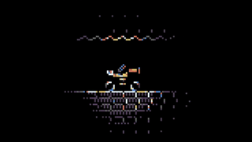
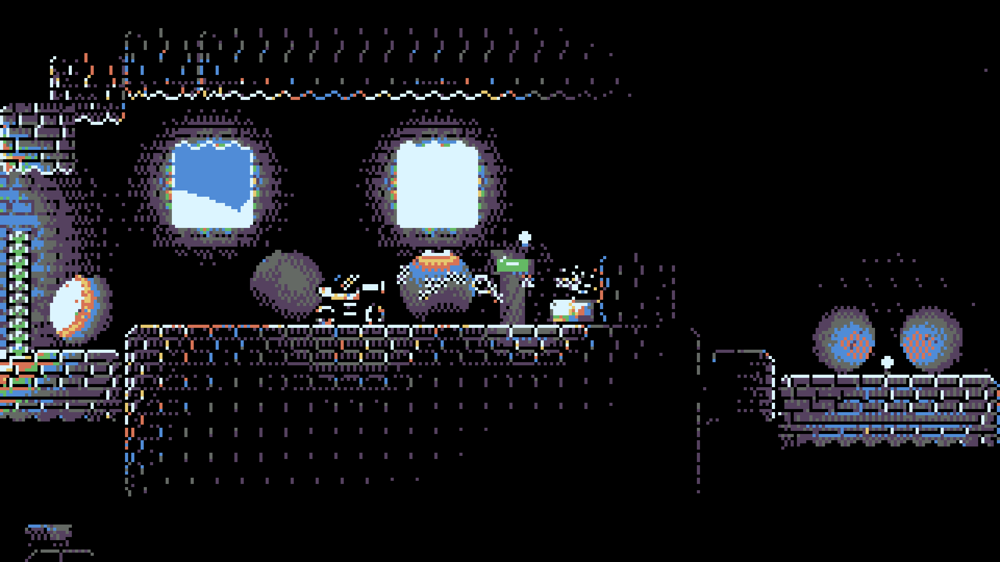
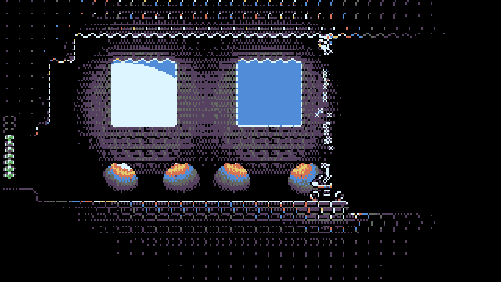
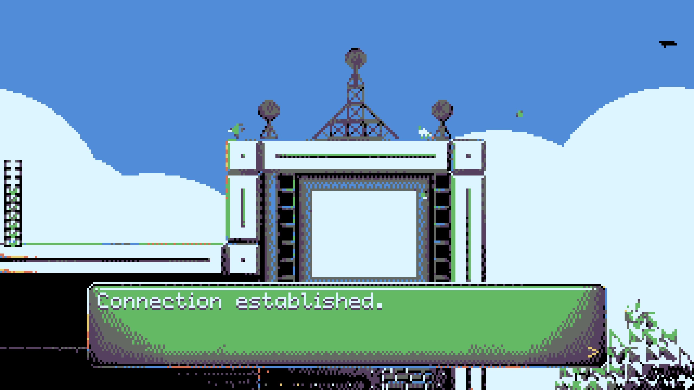
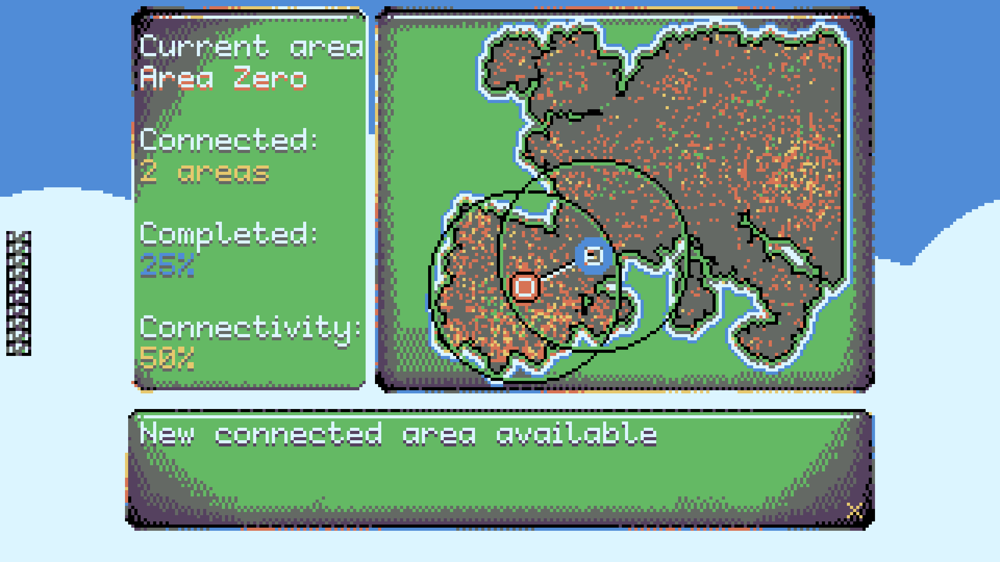
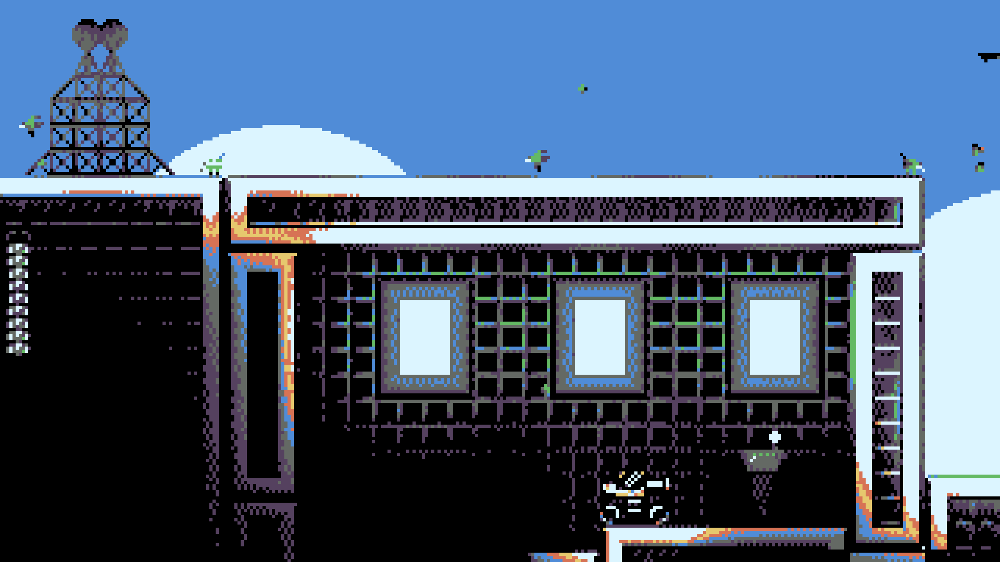
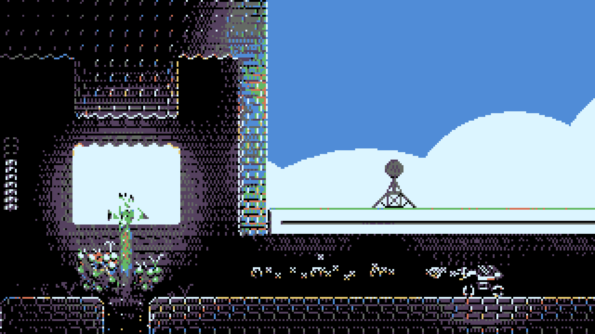
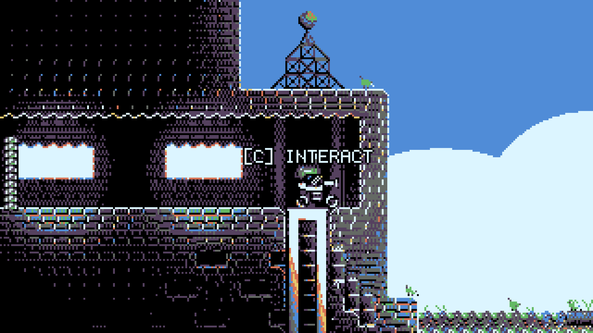

# Raylib NEXT Gamejam 2024 Entry

https://github.com/user-attachments/assets/3d621d9c-d75f-4a98-8a50-9b3797fb61d8

## [PLAY HERE](https://zyper.itch.io/cotank)

### Description

This game was ranked [1st](https://itch.io/jam/raylib-next-gamejam/results/polish-what-is-the-overall-quality-of-the-game) in the POLISH category by the community and received a special mention from the jury in the raylib NEXT gamejam. It features an 8-color palette, a compact size under 32 MB, and employs normal mapping to create dynamic lighting effects for pixel art sprites. Written in C++20 and using raylib. Inspired by the classic games like Blaster Master and Campanella 2.

### Controls

Keyboard:
 * Arrows to move
 * X to jump
 * C to shoot and interact
 * M to mute 

### License

This game source code and assets are licensed under GPL-3.0 License. Check [LICENSE](LICENSE) for further details.

*Copyright (c) 2024 Kacper Zybała*
